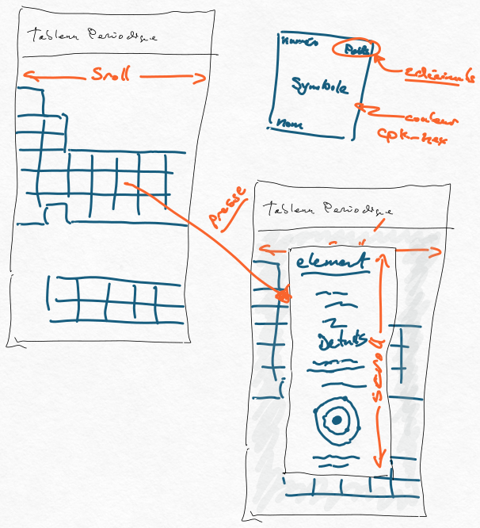

# Consignes

* Le travail est à réaliser individuellement
* Ce travail compte pour 15 % de la note finale
* La date de remise est le 14 mars 2023 à 20:42
* Le travail doit être remis par « commit » dans le projet Github Classroom, aucune autre méthode de remise ne sera acceptée
* Tout retard dans la remise de ce travail entraînera une pénalité de 10% par jour de retard jusqu’à concurrence de 5 jours. Après cette date, la note de zéro sera attribuée au travail.

# Contexte du travail pratique

Les chimistes ont beaucoup apprécié le travail fait lors de l'exercice et désirent maintenant avoir une application leur permettant de visualiser le tableau périodique et récupérer les détails sur un élément en cliquant sur ce dernier. 

Dans ce travail pratique, vous allez créer une application permettant de visualiser un tableau périodique. 
 
# Exigences conceptuelles 

Les détails sur l'aspect graphique du tableau sont libres. Cependant, vous devez respecter les éléments décris dans cette section.

Les chimistes, on fournit une esquisse de ce qu'ils espèrent avoir avec l'application. Les points importants étant:
* L'application doit avoir une barre dans le haut indiquant "CAL tableau périodique"
* Le tableau périodique doit prendre toute la taille de l'écran en hauteur.
    * Rechercher LayoutBuilder pour vous permettre d'ajuster cet élément
* Le tableau sera plus large que l'écran, il doit être possible de faire défiler le tableau horizontalement.
* L'application doit supporter une vue portrait et paysage suivant l'orientation de l'appareil.
* Chaque cellule du tableau doit avoir les éléments suivants
    * En haut à gauche le numéro atomique de l'élément
    * En haut à droite la masse de l'élément avec deux décimales
    * Dans le centre en caractères gras et plus gros que le reste des écritures le symbole de l'élément
    * Dans le bas le nom de l'élément
    * La cellule de l'élément doit utiliser l'hexadécimal contenu dans le champ `cpk-hex`
        * Si le champ `cpk-hex` est vide, vous devez mettre le champ en gradient de bleu à rouge en angle de 45 degrés.
    * Les cellules des éléments doivent être carrées
* Lorsque l'usager clique sur une cellule, vous devez ouvrir une boite de dialogue. Vous êtes responsable de faire une vue attrayante de ce contenu. Vous n'avez pas a suivre la séquence de cette liste structurer l'information pour qu'elle soit utile. Cependant les éléments indiqués ici sont requis:
    * Titre doit fournir le nom de l'élément
    * Masse
    * Point d'ébullition
    * Catégorie
    * Point de fusion
    * Son type de phase
    * Le nom de la personne qui l'a découvert
    * La description (summary)
    * Symbole
    * Image des orbites 
        * Vous pouvez distribuer également les électrons, vous n'avez pas à utiliser la représentation exacte.
        * Exemple pour l'oxygène, votre diagramme pourrait avoir l'air de l'image suivante:

    * Toute autre information que vous trouver cool à mettre

# Vue en fils de fer

# Notions manquantes

Pour réaliser ce travail, il est possible que vous devrez faire des recherches pour les éléments qui ne furent pas vus en classe. 
* InkWell pour capturer le Tap sur un élément pour générer une action
* LayoutBuilder pour obtenir la taille de l'écran pour calculer la largeur du tableau.
* Boite de dialogue

# Exigences fonctionnelles

* En vue paysage, la taille disponible dans les cellules du tableau seront trop petite pour l'affichage de toutes les informations. Votre code doit masquer tous les éléments sauf le symbole si la cellule du tableau périodique est de taille inférieure à 50 pixels. 
* Pour le défilement droit/gauche, vous devez utiliser ListView.builder.
* Bien que ça soit une application simple, porter une attention aux performances
* Vous devez respecter les règles d'écriture Dart.
* La boite de dialogue ne doit pas avoir plus que 300 pixels de haut. Sont contenu doit  défiler verticalement pour voir l'ensemble des informations.
* Le format du tableau périodique doit être généré à partir du JSON. Ainsi, si de nouveaux éléments étaient ajoutés au tableau périodique, le code ne devrait pas changer.

# Documents à remettre
* Votre code poussé dans Github

# Grille de correction

> [!danger] Il est possible d'avoir 0 pour un élément non livré.

| Critères | 3 points | 2 points | 1 point|
| --- | --- | --- | --- |
| Performance de l'application | Le code est optimisé pour effectuer un minimum de traitement pour accéder les informations du tableau périodique | Le code requiert un accès anormalement élevé pour les éléments du tableau.  | Le code effectue trop de traitement pour afficher le contenu du tableau périodique. |
| Boite de dialogue | La boite contient tous les éléments demandés et a une apparence professionnelle et agréable à utiliser. | L'ensemble des éléments demandé apparaissent dans la boite de dialogue. | La boite existe, mais ne représente pas tous les éléments demandés dans les requis. |
| Respect des directives | Toutes les directives sont présentes et contiennent des améliorations de la qualité de l'application | Toutes les directives furent respectées | Une partie des directives sont respectées. |
| Qualité du code | Le code respecte entièrement les règles Dart et il y a des commentaires pertinents lorsque requis | Le code est bien structuré avec de bon nom de variable et commentaires | Le code est inconsistant et difficile à comprendre. |
| Vue paysage | Tous les éléments s'ajustent correctement et conservent une allure professionnel autant pour une vue paysage que portrait. | Les fonctionnalités sont correctes et l'application utilisable. | Certaines vues ne sont pas fonctionnelles. |

