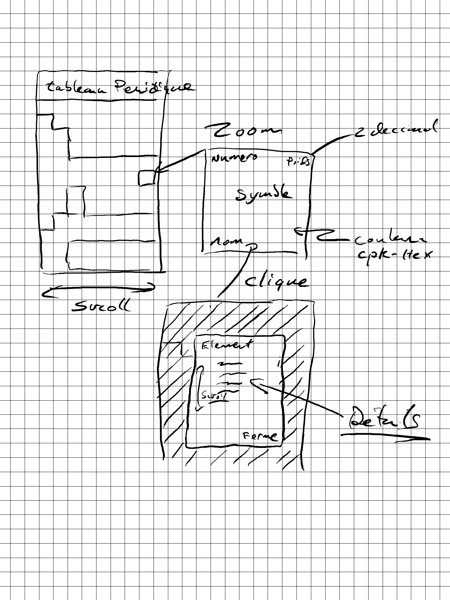

# Consignes

* Le travail est à réaliser individuellement
* Ce travail compte pour 15 % de la note finale
* La date de remise est le 14 mars 2022 à 10:42
* Le travail doit être remis par « commit » dans le projet Github Classroom, aucune autre méthode de remise ne sera acceptée
* Tout retard dans la remise de ce travail entraînera une pénalité de 10% par jour de retard jusqu’à concurrence de 5 jours. Après cette date, la note de zéro sera attribuée au travail.

# Contexte du travail pratique

Les chimistes ont beaucoup apprécié le travail fait lors de l'exercice et désirent maintenant avoir une application leur permettant de visualiser le tableau périodique et récupérer les détails sur un élément en cliquant sur ce dernier. 

Dans ce travail pratique, vous allez créer une application permettant de visualiser un tableau périodique. Vous pouvez soit utiliser vos classes produites lors de l'exercice 04 ou bien prendre la version proposée par le professeur.
 
# Exigences conceptuelles 

Les détails sur l'aspect graphique du tableau sont libres. Cependant, vous devez respecter les éléments fournis dans cette section.

Les chimistes, on fournit une esquisse de ce qu'ils espèrent avoir avec l'application. Les points importants étant:
* L'application doit avoir une barre dans le haut indiquant "tableau périodique"
* Le tableau périodique doit prendre la taille de l'écran en hauteur.
    * Rechercher LayoutBuilder pour vous permettre d'ajuster cet élément
* Le tableau sera plus large que l'écran, il doit être possible de faire défiler le tableau horizontalement.
* Chaque cellule du tableau doit avoir les éléments suivants
    * En haut à gauche le numéro atomique de l'élément
    * En haut à droite la masse de l'élément avec deux décimales
    * Dans le centre en caractères gras et plus gros que le reste des écritures le symbole de l'élément
    * Dans le bas le nom de l'élément
    * La cellule de l'élément doit utiliser l'hexadécimal contenu dans le champ cpk-hex
        * Si le champ cpk-hex est vide, vous devez mettre le champ un radiant de bleu à rouge en angle de 45 degrés
    * Les cellules des éléments doivent être carrées
* Lorsque l'usager clique sur une cellule, vous devez ouvrir une boite de dialogue. La boite doit inclure au minimum les informations suivantes. Vous êtes responsable de faire une vue attrayante de ce contenu. Vous n'avez pas a suivre la séquence de cette liste structurer l'information pour qu'elle soit utile.
    * Titre doit fournir le nom de l'élément
    * Masse
    * Point d'ébullition
    * Catégorie
    * Point de fusion
    * So type de phase
    * Le nom de la personne qui l'a découvert
    * La description (summary)
    * Symbole
    * Phase
    * Toute autre information que vous trouvez cool à mettre

# Notions manquantes

Pour réaliser ce travail, vous devrez faire des recherches pour les éléments qui ne furent pas vus en classe. 
* InkWell pour capturer le Tap sur un élément pour générer une action
* LayoutBuilder pour obtenir la taille de l'écran pour calculer la largeur du tableau.
* Boite de dialogue

# Exigences fonctionnelles

Exigences fonctionnelles 

* Si la taille disponible est trop petite pour l'affichage, vous pouvez mettre des règles pour retirer le texte et ne conserver que le symbole. Utilisez votre jugement.
* Vous n'avez pas à vous préoccuper d'une vue en orientation paysage pour votre tableau...
* Pour le défilement droit/gauche, vous devez utiliser ListView.builder.
* Bien que ça soit une application simple, porter une attention aux performances
* Aucun fichier ne devrait contenir plus que 100 lignes, vous devez fragmenter vos widgets pour conserver une structure respectant cette consigne.
* La boite de dialogue ne doit pas avoir plus que 300 pixels de haut. Il doit donc être possible de faire défiler le contenu verticalement pour voir l'ensemble des informations.

# Documents à remettre
* Votre code
* Document notes.md contenant les informations suivantes: (max 50 lignes)
    * Les optimisations que vous avez faites en performance
    * Explique la structure que vous avez choisie pour votre boite de dialogue sur les éléments

# Grille de correction

Éléments évalués
* Qualité de l'interface
* Optimisation de l'espace
* Performance de l'application
* Créativité
* Respect des directives
* Qualité du code

